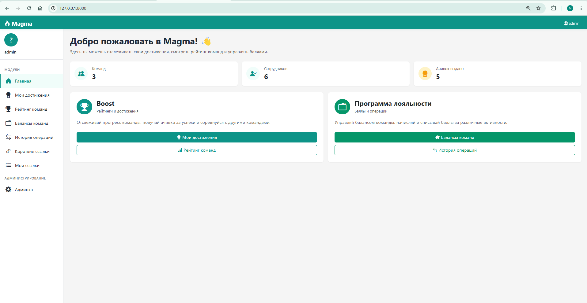
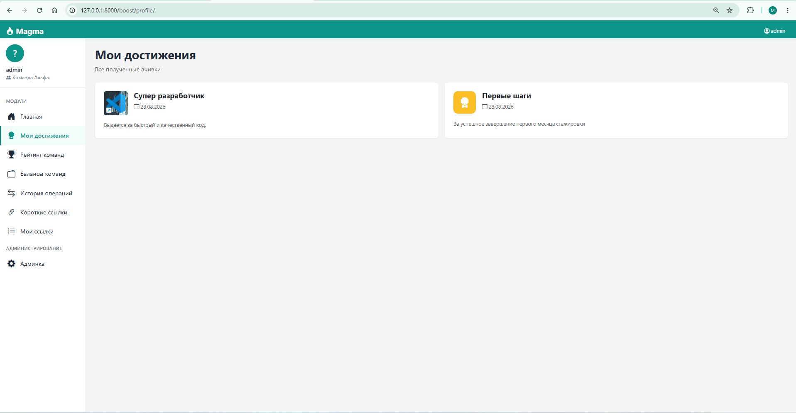
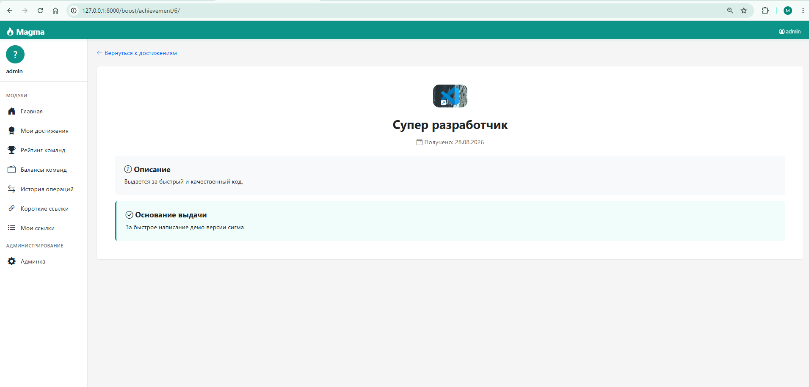
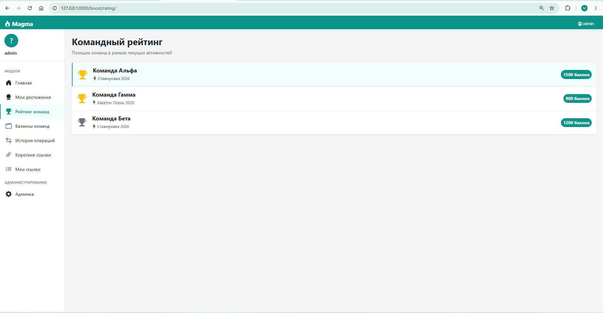
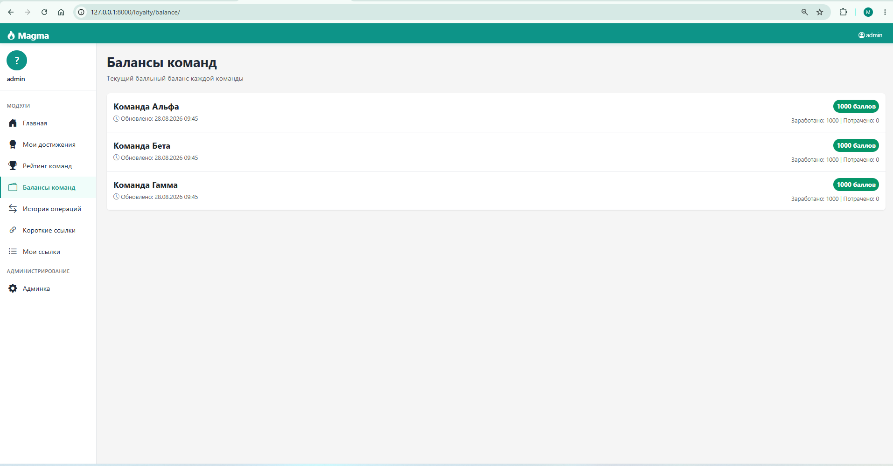
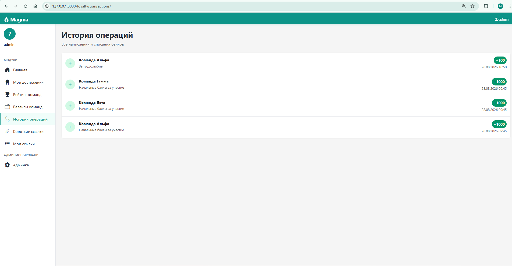
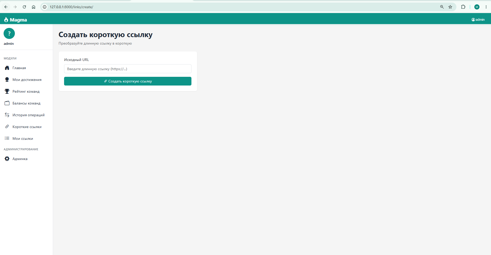
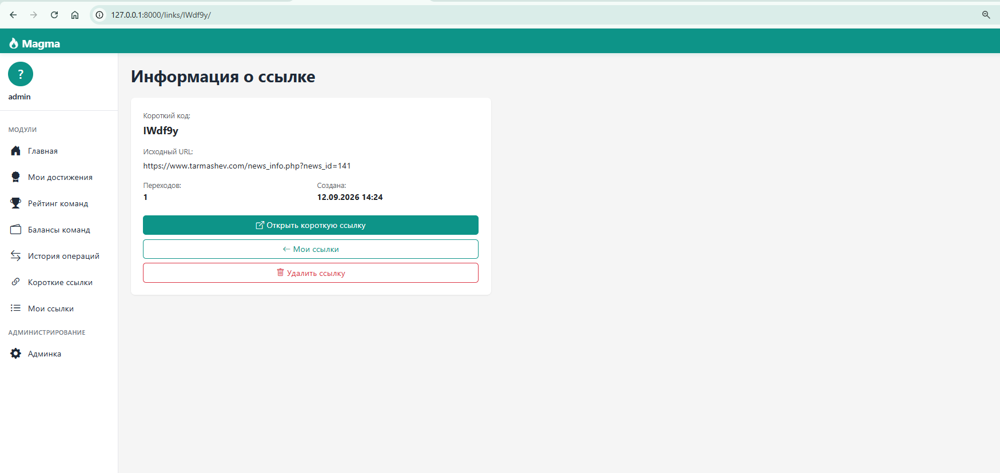
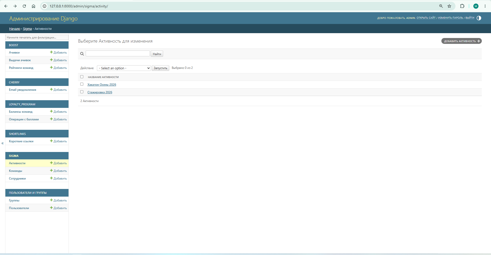

# 🔥 Magma

**Magma** — корпоративная платформа для управления достижениями сотрудников, командными рейтингами, программой лояльности и короткими ссылками.

Построена на **Django 6.1** с модульной архитектурой: каждый функциональный блок выделен в отдельное Django-приложение.

---

## 📸 Скриншоты

### Главная страница



### Профиль сотрудника и достижения



### Детальная карточка ачивки



### Командный рейтинг



### Балансы команд (Программа лояльности)



### История операций с баллами



### Создание короткой ссылки



### Мои короткие ссылки


### Информация о короткой ссылке



### Админка Django



---

## Технологии

- **Backend:** Python 3.13, Django 6.1
- **База данных:** SQLite (для разработки), PostgreSQL (для продакшна)
- **Frontend:** Django Templates, Bootstrap 5, Bootstrap Icons
- **Email:** Django Console Email Backend (для демо), SMTP (для продакшна)
- **Дополнительно:** Pillow (для изображений ачивок)

---

## Модули проекта

### 🏆 Boost

Рейтинги команд и система достижений (ачивок).

- Командный рейтинг по активностям
- Библиотека ачивок с изображениями
- Ручная выдача ачивок администратором
- Профиль сотрудника с полученными достижениями
- Детальные карточки ачивок

### Cherry (Вишенка)

Система email-уведомлений.

- Автоматическая отправка письма при выдаче ачивки
- История отправленных уведомлений
- Работает через Django Signals

### 🔗 ShortLinks

Сервис коротких ссылок.

- Создание коротких ссылок из длинных URL
- Счётчик переходов
- Страница "Мои ссылки" с историей
- Удаление ссылок (в веб-интерфейсе и массово в админке)
- Быстрый редирект по короткому коду

### 💰 Loyalty Program

Программа лояльности.

- Балансы баллов команд
- История операций (начисления/списания)
- Интеграция с Boost для формирования рейтинга

### 🏢 Sigma

Базовые сущности платформы.

- Сотрудники
- Команды
- Активности (стажировки, конкурсы)

---

## 📁 Структура проекта

```bash
sigma_boost_project/
├── config/              # Настройки проекта (Sigma-платформа)
│   ├── settings.py
│   ├── urls.py
│   ├── views.py         # Главная страница
│   └── wsgi.py
├── sigma/               # Базовые сущности (Сотрудники, Команды, Активности)
├── boost/               # Модуль Boost (Рейтинги, Ачивки)
├── loyalty_program/     # Программа лояльности (Баллы)
├── cherry/              # Модуль Cherry (Email-уведомления)
├── shortlinks/          # Модуль коротких ссылок
├── templates/           # Общие HTML-шаблоны
── media/               # Загруженные файлы (изображения ачивок)
├── docs/screenshots/    # Скриншоты для документации
├── manage.py
├── README.md
└── requirements.txt
```

## 🚀 Установка и запуск

### 1. Клонируйте репозиторий

```bash
git clone https://github.com/mikhailstarikov/magma.git
cd magma
```

### 2. Создание виртуального окружения

```bash
python -m venv venv
source venv/bin/activate  # Linux/Mac
venv\Scripts\activate     # Windows
```

### 3. Установите зависимости

```bash
    pip install -r requirements.txt
```

### 4. Примените миграции

python manage.py migrate

### 5. Создайте суперпользователя

python manage.py createsuperuser

### 6. Запустите сервер

python manage.py runserver

Откройте в браузере: <http://127.0.0.1:8000/>

## 🧪 Тестирование

Проект покрыт автоматическими тестами с использованием **pytest** и **pytest-django**.

### Запуск тестов

```bash
pytest --cov=. --cov-report=html --cov-report=term -v

Покрытие кода
Общее покрытие: ~88%
Модели: 96-100%
Views: 62-100%
Всего тестов: 38
Структура тестов
sigma/tests.py — тесты базовых сущностей (Team, Activity, Employee)
boost/tests.py — тесты ачивок и рейтингов
shortlinks/tests.py — тесты коротких ссылок
loyalty_program/tests.py — тесты программы лояльности
cherry/tests.py — тесты email-уведомлений
test_views.py — интеграционные тесты всех страниц
conftest.py — общие фикстуры для тестов
```
